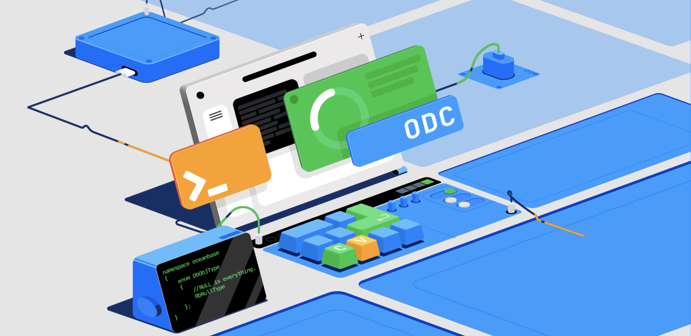

中文 | [English](./README.md)

# OceanBase 开发者中心 (ODC)

OceanBase 开发者中心（以下简称 ODC）是开源的全场景数据库开发和数据管理协同工具，通过协同开发解决数据库的变更风险管控、数据管理和数据安全问题。


## 🤔 选择 ODC 的理由

### 随时随地高效 SQL 开发

- ODC 基于现代 WEB 架构，随时随地，只要有浏览器就可以访问您的数据库。
- ODC SQL 开发功能全面且易用，桌面开发工具有的功能 ODC 也有，甚至支持 PL 调试。
  

### 守护 SQL 开发过程的每一次变更

- 在 SQL 开发过程的全部场景，包括可视化对象管理、SQL 查询、数据编辑、数据导入和导出、... ，ODC 都内置了风险控制。
- ODC 提供基于项目的协同和变更审批流程，并且内置了 SQL 检查规则、SQL 窗口规范、风险等级识别。
  

### 自动数据生命周期管理

- ODC 支持数据按照保留时长清理或归档，5 分钟构建你的冷热数据分离系统。
- ODC 不仅支持按照数据的时间标记处理，也支持按照分区批量处理。
- 还可以通过 ODC SQL 计划任务完成计算任务，为什么还要继续使用你的 CRONTAB ？
  

### 全场景敏感数据保护

- ODC 数据脱敏支持静态场景也支持动态场景，结构变更、SQL 查询、结果集导出、数据导出 全部开发场景都会脱敏。
- 安全管理员配置敏感数据规则和脱敏算法，DBA 和 开发 都无法接触敏感数据。
  

### 无需改变已有系统就可以集成 ODC 到当前工作流程

- 无需改变您的系统就可以把 ODC 集成到您当前的数据库开发协同工作流程中.
- SSO、审批集成、SQL 审核集成、堡垒机集成、审计集成，企业管控集成需要的能力全都有。
  

## 🚀 安装部署

ODC 有 2 个产品形态，分别是 WEB 版和桌面版。

- **桌面版**：适用于个人开发场景，是一款高效易用的 SQL 开发工具，桌面版支持的操作系统包括 Windows、MacOS。
- **WEB 版**：适用于多人协同开发场景，包含协同开发、风险控制、数据安全等全部功能，是数据库开发管控协同一体化平台，WEB 版提供 rpm、docker 镜像等安装介质，支持 x86、arm 架构，WEB 版也包含桌面版 SQL 开发的全部功能。

### WEB 版部署

本章节描述的部署步骤仅适用于功能体验，生产环境部署请参考 [部署指南](https://github.com/oceanbase/odc-doc/blob/V4.2.0/zh-CN/1100.deployment-guide/100.deployment-overview.md) 。

#### 环境要求

ODC WEB 版的安装介质为 docker 镜像，依赖一个 OceanBase MySQL 租户作为 MetaDB。如果您没有 MetaDB，请根据下面的**步骤 1：创建一个元数据库** 指引来创建一个元数据库。

在部署 ODC WEB 版之前，请准备以下环境，确保环境资源和规格满足要求，具体检查项包括：

- 部署的机器有至少 2 个空闲 CPU core、4GB 内存。
- 已经安装 docker 并启动服务，推荐使用 docker 最新版。
- MetaDB 租户规格为 1C4G 或以上。

#### （可选）步骤 1：创建一个 MetaDB

使用下面的简单脚本就可以创建一个 MetaDB。为了创建 MetaDB，需要您使用下面的脚本创建一个 OceanBase 集群以及一个测试租户，这将花费您大约 2 分钟时间。

请注意：您用于部署 OceanBase 集群的机器应至少含有 4 vCPU 以及 8 GB 空闲内存。

以下脚本仅用于演示用。如果您已经拥有一个 MetaDB，请略过此步骤。

```shell
# 启动一个 OceanBase 集群的同时会自动创建出一个测试租户
docker run -p 2881:2881 --name oceanbase-ce -d oceanbase/oceanbase-ce

# 连接位于该集群的测试租户
docker exec -it oceanbase-ce ob-mysql root

# 在该租户中创建一个名为 'odc' 的数据库用户以及一个名为 'odc_metadb' 的数据库。将 <password> 替换为您的真实密码
CREATE USER odc IDENTIFIED BY '<password>';
CREATE DATABASE odc_metadb;
GRANT ALL ON odc_metadb.* TO odc;
```

#### 步骤 2：启动 ODC Server

启动 ODC docker 容器的参考脚本如下。

```shell
# 启动 ODC。下面例子将限制容器最大占用 2 CPU 核以及 4GB 内存

# 将 <your_metadb_password> 替换为您的 MetaDB 的真实密码。如果您按照步骤 1 创建出一个 MetaDB，那么将 <your_metadb_password> 替换为您在步骤 1 中设置的密码

# 使用参数 <your_admin_password> 为 ODC 的 admin 账户设置一个初始密码。这个密码在您登录 ODC 时将会被用到。密码必须满足以下条件：
# - 至少 2 个数字
# - 至少 2 个小写字母
# - 至少 2 个大写字母
# - 至少 2 个特殊字符，允许的特殊字符的范围是 ._+@#$% 
# - 不包含空格和其他特殊字符
# - 长度为 8-32

# 启动 ODC 将花费大约 2 分钟

docker run -d -it --name odc --network host \
--cpu-period 100000 --cpu-quota 200000 --memory=4G \
-e "DATABASE_HOST=127.0.0.1" -e "DATABASE_PORT=2881" -e "DATABASE_NAME=odc_metadb" \
-e "DATABASE_USERNAME=odc@test" -e 'DATABASE_PASSWORD=<your_metadb_password>' \
-e 'ODC_ADMIN_INITIAL_PASSWORD=<your_admin_password>' -e "ODC_SERVER_PORT=8989" \
oceanbase/odc:latest
```

#### 更多

部署完成 ODC 后，您可以根据 [快速指南](https://github.com/oceanbase/odc-doc/blob/V4.2.0/zh-CN/300.quickstart/200.web-odc-quickstart/300.quickstart-using-web-odc.md) 的指引开始您的 ODC 之旅。

### 桌面版安装

ODC 使用 Electron 技术把 WEB 应用构建为桌面应用，支持多个桌面操作系统。安装桌面应用程序的方式比较简单，下载对应版本的安装包双击安装即可。
ODC 桌面版使用 h2database 嵌入式数据库作为 MetaDB，所以您不需要配置 MetaDB 数据库。

ODC 桌面版安装包下载地址

- Windows 64位版本: [odc-win64-with-jre.exe](https://obodc-front.oss-cn-beijing.aliyuncs.com/ODC%204.2.2/OceanBase%20Developer%20Center%20Setup%204.2.2%20win64jre.exe)
- MacOS 64位版本: [odc-macos-with-jre.dmg](https://obodc-front.oss-cn-beijing.aliyuncs.com/ODC%204.2.2/OceanBase%20Developer%20Center-4.2.2jre.dmg)
- Fedora/Ubuntu 64位版本: [odc-ubuntu.deb](https://obodc-front.oss-cn-beijing.aliyuncs.com/ODC%204.2.2/OceanBase%20Developer%20Center%20Setup%204.2.2%20amd64.deb)

#### 更多

部署完成桌面版 ODC 后，您可以根据 [快速指南](https://github.com/oceanbase/odc-doc/blob/V4.2.0/zh-CN/300.quickstart/100.client-odc-quickstart/300.quickstart-using-client-odc.md) 的指引开始您的 ODC 之旅。

## 🤝 参与贡献

ODC 期望构建一个开放的社区，一起打造数据库开发管控协同工具，我们欢迎任何形式的贡献，您可以：

- 通过 [Issues](https://github.com/oceanbase/odc/issues) 提交 bug。
- 通过 [Discussion](https://github.com/oceanbase/odc/discussions) 参与或发起讨论。
- 通过 [Pull requests](https://github.com/oceanbase/odc/pulls) 提交问题修复或者功能特性。
- 将 ODC 介绍给您的朋友和同事，分享 ODC 的功能和优势，帮助 ODC 社区扩大影响力。

关于参与贡献的更多指南请参阅 [贡献指南](docs/zh-CN/CONTRIBUTION.md) ，
对于代码变更类型的 Pull requests 的详细指南请参阅 [开发指南](docs/zh-CN/DEVELOPER_GUIDE.md)。

## 🛤️ 路线图

ODC 2023 年路线图如下。

| 方向     | Q1                                         | Q2                                                         | Q3                                            | Q4                                        |
|--------|--------------------------------------------|------------------------------------------------------------|-----------------------------------------------|-------------------------------------------|
| SQL 开发 | OceanBase 4.0/4.1 SSL 连接 大规模表列场景性能提升 生僻字展示 | PL执行调试支持更多场景 全链路 TRACE 导入兼容 PL/SQLDeveloper 时间数字格式兼容Oracle | 支持MySQL数据源 常用运维命令助手 桌面版资源占用优化                 | 支持 Oracle 数据源 并行执行计划可视化 OceanBase AP 功能适配 |
| 变更风险管控 | 自定义角色                                      | 基于项目的管控协同 SQL 检查和 SQL 窗口规范 风险等级识别 数据变更自动回滚脚本               | 无锁结构变更 SQL 检查最佳实践模板                           | 基于流量的 SQL 检查 结构比对和结构同步                    |
| 数据生命周期 | SQL 计划任务 自动分区管理                            | 数据归档/清理 支持 OceanBase MySQL 模式                              | 无锁数据变更 数据归档/清理 支持 MySQL 和 OceanBase Oracle 模式 | 行级回收站 逻辑备份恢复 备份恢复支持云存储                    |
| 安全和合规  |                                            | 动态数据脱敏 操作审计覆盖更多范围                                          | 库表级别权限管控 敏感列自动识别                              | 敏感数据保护合规认证 数据库 SQL 审计                     |
| 协同效率   | 自动授权规则 批量创建用户、连接配置                         | SSO 集成 外部审批集成 SQL 审核集成                                     | Open API 堡垒机集成                                | 数据库分组和逻辑库 测试数据生成支持多表 多数据源元数据全局索引          |

## 许可证

ODC 采用 [Apache-2.0](https://www.apache.org/licenses/LICENSE-2.0) 许可证.

## 帮助和支持

我们欢迎您通过 GitHub 缺陷提出您的问题或给出反馈。如果您使用 GitHub 存在困难，您可以加入我们的钉钉群来寻求帮助。

* [GitHub Issues](https://github.com/oceanbase/odc/issues) 。
* [加入 ODC 钉钉群](https://qr.dingtalk.com/action/joingroup?code=v1,k1,OacNAwktCbVGqRk2jQ0TDga6j6AHtXtvU7ZrD6Orah0=&_dt_no_comment=1&origin=11) 。
