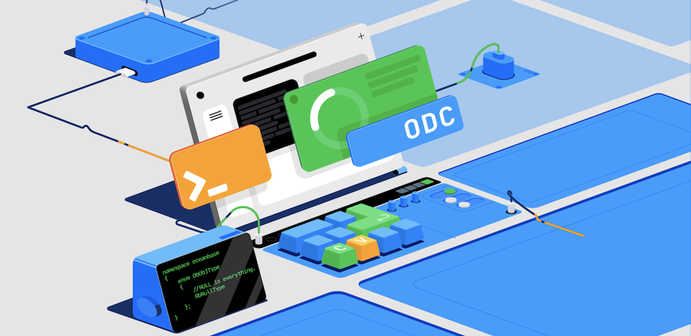

English | [中文](./README-zh-CN.md)

# OceanBase Developer Center (ODC)

OceanBase Developer Center, or ODC for short, is an open-source, all-encompassing tool for collaborative database development and data management across various scenarios. By streamlining collaborative efforts, ODC addresses the challenges of risk management during database changes, efficient data management, and data security concerns.


## 🤔 What ODC Offers and Why Choose ODC?

### Effortless SQL Development, Anytime, Anywhere

- Utilizing modern web architecture, ODC provides unparalleled accessibility to your databases, allowing you to perform SQL development tasks on the go, right from your web browser.
- ODC boasts a comprehensive and user-friendly SQL development environment that encompasses all the features you'd expect from desktop development tools, and even offers support for PL debugging.
  

### Guard Every Change in Your SQL Development Journey

- Throughout the entire SQL development process, ODC is your steadfast companion, offering risk control at every turn. From visual object management to SQL queries, data editing, and import/export tasks, ODC comes equipped with built-in risk management tools.
- ODC introduces project-based collaboration and change approval workflows, complemented by SQL validation rules, SQL window guidelines, and risk level identification.
  

### Automated Data Lifecycle Management

- ODC facilitates data retention policies, enabling you to effortlessly purge or archive data based on specified time frames, and build a hot-cold data separation system tailored to your needs in just 5 minutes.
- Beyond time-based data handling, ODC supports batch processing based on partitioning, allowing you to efficiently manage large datasets.
- With ODC's SQL scheduled tasks, completing computational tasks becomes a breeze, rendering traditional CRONTAB systems obsolete.
  

### Sensitive Data Protection in Every Scenario

- ODC's data desensitization capabilities extend to both static and dynamic scenarios, ensuring that sensitive information remains safeguarded during schema changes, SQL queries, result set exports, and data extractions.
- Security administrators can configure sensitive data rules and desensitization algorithms, ensuring that both DBAs and developers are unable to access sensitive data.
  

### Seamless Integration Without Additional Code Development

- Integrate ODC seamlessly into your current database development workflow without the need for disruptive changes.
- From Single Sign-On (SSO) to approval integration, SQL review integration, bastion host integration, and audit integration, ODC offers a comprehensive suite of features that cater to enterprise control needs.
  

## 🚀 Installation and Deployment

ODC comes in two distinct forms: the dynamic Web version and the efficient Desktop version. Let's take a closer look at these offerings:

- **Desktop Version**: Effortless Individual Development

  The Desktop version is designed for personal development scenarios, offering an efficient and user-friendly SQL development tool. Supported operating systems include Windows and MacOS.

- **Web Version**: Unleash Collaborative Power

  The Web version caters to multi-person collaborative development scenarios, encompassing collaborative development, risk control, data security, and more. It serves as an integrated platform for database development, management, and control. The Web version provides various installation mediums, such as rpm and Docker images, supporting x86 and ARM architectures. It also encapsulates all the features of SQL development in the Desktop version.

### Deploying the Web Version

Please note that the deployment steps outlined in this section are meant for experiencing the functionality. For production environment deployment, please refer to the [Deployment Guide](https://github.com/oceanbase/odc-doc/blob/V4.2.0/en-US/1100.deployment-guide/100.deployment-overview.md).

#### Before You Start

The ODC Web version is packaged as a Docker image and relies on an OceanBase MySQL tenant as MetaDB. If you have not had a MetaDB, please follow **(Optional) Step 1: Create a MetaDB** below for instructions.

Before you start, ensure that your environment meets the following requirements:

- Docker is installed and the service is up and running. It is recommended to use the latest version of Docker.
- The deployment machine for ODC has at least 2 available CPU cores and 4 GB of RAM.
- The MetaDB requires a minimum specification of 1 vCPU and 4 GB of RAM.

#### (Optional) Step 1: Create a MetaDB

Use the sample script below to create a MetaDB if you do not already have one. To create a MetaDB, it would require an OceanBase cluster and a test tenant, which the script would also complete for you. The creation process may take about 2 minutes.

Please note that the deployment machine for the OceanBase cluster should have at least 4 vCPUs and 8 GB of RAM.

This script is for demo purposes only. If you have already had a MetaDB, please skip this step.

```shell
# Start an OceanBase cluster, which would automatically create a test tenant.
docker run -p 2881:2881 --name oceanbase-ce -d oceanbase/oceanbase-ce

# Connect to the test tenant within the cluster.
docker exec -it oceanbase-ce ob-mysql root

# Create a database user 'odc' and schema 'odc_metadb' within the tenant. Replace <password> with the actual password of your choice.
CREATE USER odc IDENTIFIED BY '<password>';
CREATE DATABASE odc_metadb;
GRANT ALL ON odc_metadb.* TO odc;
```

#### Step 2: Launch the ODC Server

Use the script below to launch the ODC Docker container.

```shell
# Launch ODC Server. The following example limits the container to 2 CPU cores and 4 GB of memory.

# Replace <your_metadb_password> with the actual password of your MetaDB. If you have followed Step 1 above to create the MetaDB, then replace <your_metadb_password> with the password you set in Step 1.

# Set the initial password for your admin account of ODC using the parameter <your_admin_password>. This password would be the one you use to log into the ODC Web. The password must satisfy the following requirements:
# - At least 2 digits
# - At least 2 lowercase letters
# - At least 2 uppercase letters
# - At least 2 special characters, allowed special characters includes ._+@#$%
# - No spaces or other special characters
# - 8~32 characters in length

# The process to launch ODC may take about 2 minutes.

 docker run -d -it --name odc --network host \
 --cpu-period 100000 --cpu-quota 200000 --memory=4G \
 -e "DATABASE_HOST=127.0.0.1" -e "DATABASE_PORT=2881" -e "DATABASE_NAME=odc_metadb" \
 -e "DATABASE_USERNAME=odc@test" -e 'DATABASE_PASSWORD=<your_metadb_password>' \
 -e 'ODC_ADMIN_INITIAL_PASSWORD=<your_admin_password>' \
 -e "ODC_SERVER_PORT=8989" \
 oceanbase/odc:latest
```

#### What to do next

After deploying ODC Web, you can follow our [Quick Start guide](https://github.com/oceanbase/odc-doc/blob/V4.2.0/en-US/300.quickstart/200.web-odc-quickstart/3.quickstart-using-web-odc.md) to start your journey with ODC.

### Installing the Desktop Version

The Desktop version harnesses Electron technology to transform the web application into a desktop application, offering compatibility with multiple desktop operating systems. Installing the desktop application is straightforward: simply download the version-specific installer and double-click to initiate the installation process.

ODC Desktop version employs the h2database embedded database as MetaDB, eliminating the need for MetaDB database configuration.

Here are the download links for ODC Desktop version installers:

- Windows 64-bit version: [odc-win64-with-jre.exe](https://obodc-front.oss-cn-beijing.aliyuncs.com/ODC%204.2.2/OceanBase%20Developer%20Center%20Setup%204.2.2%20win64jre.exe)
- MacOS version: [odc-macos-with-jre.dmg](https://obodc-front.oss-cn-beijing.aliyuncs.com/ODC%204.2.2/OceanBase%20Developer%20Center-4.2.2jre.dmg)
- Fedora/Ubuntu version: [odc-ubuntu.deb](https://obodc-front.oss-cn-beijing.aliyuncs.com/ODC%204.2.2/OceanBase%20Developer%20Center%20Setup%204.2.2%20amd64.deb)

#### What to do next

After installing the Desktop version, you can follow our [Quick Start guide](https://github.com/oceanbase/odc-doc/blob/V4.2.0/en-US/300.quickstart/100.client-odc-quickstart/3.quickstart-using-client-odc.md) to start your journey with ODC.

## 🤝 Join the Contributing Community

ODC envisions an open community, collaboratively crafting a database development and control management tool. We welcome your contributions in any form:

- Report bugs through [Issues](https://github.com/oceanbase/odc/issues).
- Participate in or initiate discussions via [Discussion](https://github.com/oceanbase/odc/discussions).
- Contribute bug fixes or new features through [Pull requests](https://github.com/oceanbase/odc/pulls).
- Share ODC to your friends and colleagues, and help expand the ODC community's influence.

For detailed guidelines on contributing, please refer to the [Contribution Guide](docs/en-US/CONTRIBUTION.md). For comprehensive guidance on different types of code changes via pull requests, consult the [Pull requests](https://github.com/oceanbase/odc/pulls).

## 🛤️ Roadmap Ahead

Here's a glimpse into ODC's 2024 roadmap.

| **Direction**                 | **Q1**                                                                                                                                                                                                                                                                                                                                                                                                                                                          | **Q2**                                                                                                                                                                                                                                                                                                                                                                                                                                                                                                                                                                        | **Q3**                                                                                                                                                                                                                                                                                                                                                       | **Q4**                                                                                                                                                                                                              |
|-------------------------------|-----------------------------------------------------------------------------------------------------------------------------------------------------------------------------------------------------------------------------------------------------------------------------------------------------------------------------------------------------------------------------------------------------------------------------------------------------------------|-------------------------------------------------------------------------------------------------------------------------------------------------------------------------------------------------------------------------------------------------------------------------------------------------------------------------------------------------------------------------------------------------------------------------------------------------------------------------------------------------------------------------------------------------------------------------------|--------------------------------------------------------------------------------------------------------------------------------------------------------------------------------------------------------------------------------------------------------------------------------------------------------------------------------------------------------------|---------------------------------------------------------------------------------------------------------------------------------------------------------------------------------------------------------------------|
| **SQL Development**           | <ul><li>Support for Oracle</li><li>Support for comparing/synchronizing homogenous database structures</li><li>Built-in common code snippets</li></ul>                                                                                                                                                                                                                                                                                                           | <ul><li>Lock-free structural changes with write throttling support</li><li>Lock-free structural changes adapted to OB kernel rename table behavior</li><li>Capability for lock-free data changes</li></ul>                                                                                                                                                                                                                                                                                                                                                                    | <ul><li>Optimize PL development experience (supports viewing references, locating PL code blocks quickly based on</li><li>resource structure, jumping to corresponding DDL by object name, etc.)</li><li>Enhanced database object management capabilities</li></ul>                                                                                          | <ul><li>Support for comparing/synchronizing heterogenous database structures</li><li>Ability to provide scenario-based test data construction</li></ul>                                                             |
| **Change Risk Control**       | <ul><li>Database-level access control</li><li>Automatic identification of offline DDL changes</li></ul>                                                                                                                                                                                                                                                                                                                                                         | <ul><li>Support for logical database DDL changes</li><li>Support for multi-database changes (pipeline changes)</li><li>database administrator access control</li><li>Table-level access control</li><li>New global project administrator role</li></ul>                                                                                                                                                                                                                                                                                                                       | <ul><li>Support for state-based structural changes</li><li>Support for logical database DML/DQL</li><li>Template configuration for SQL-check</li><li>Change rollback ability based on row-level recycle bin</li></ul>                                                                                                                                        | <ul><li>Command line window actions included in operational auditing</li><li>Automatic discovery of sensitive data</li><li>Data trajectory capabilities</li><li>Structural change trajectory capabilities</li></ul> |
| **Data Lifecycle Management** | <ul><li>Support for unique index tables</li><li>Support for SQL preview</li><li>Support for archiving within the same database</li><li>Partitioning plan capabilities for OB Oracle</li><li>Partitioning plan supports more field types</li><li>Improved usability of partitioning plan task management</li></ul>                                                                                                                                               | <ul><li>Support for archiving from OB to files/OSS/S3</li><li>Performance optimization for source-side queries</li><li>Enhanced anti-explosion capabilities</li><li>Variable setting optimization</li><li>Control over task running time periods</li><li>Support for data processing in index order without sharding</li><li>Data cleanup with historical database data verification</li><li>Homogenous data archiving with incremental DDL change synchronization</li></ul>                                                                                                  | <ul><li>Support for archiving from OB to file COS/OBS;</li><li>Support for synchronizing archive table structures in heterogeneous databases;</li><li>Support for archiving scenarios with related (foreign key) tables;</li><li>Risk warning capabilities when creating data archiving/cleanup;</li></ul>                                                   | <ul><li>Support for logical libraries</li><li>Support for Oracle data sources</li></ul>                                                                                                                             |
| **Stability**                 | <ul><li>Optimization of task framework (ensures reliable task scheduling)</li><li>Support for alarm notifications on task anomalies</li></ul>                                                                                                                                                                                                                                                                                                                   | -                                                                                                                                                                                                                                                                                                                                                                                                                                                                                                                                                                             | -                                                                                                                                                                                                                                                                                                                                                            | -                                                                                                                                                                                                                   |
| **Usability**                 | <ul><li>Linkage between SQL development tabs and resource tree</li><li>Improved usability of the database selection component</li><li>Support for parameter editing when copying partial work orders</li><li>Support for custom configuration items (including shortcuts, etc.)</li><li>Verification of English terms in the product</li><li>Optimized desktop version memory usage to within 1GB</li><li>Support for logical deletion of work orders</li></ul> | <ul><li>Optimization of work order management (end time/progress/logs, etc.)</li><li>Interaction optimization for planned (periodic) task management (work order status/display)</li><li>Project-related concept guidance</li><li>Enhanced search capabilities in the resource tree and initiating work orders through it</li><li>UI theme refresh</li><li>Strengthened SQL window code auto-completion</li><li>Development of an operational metrics system</li><li>Verification of English terms for data sources, user permissions, external integration modules</li></ul> | <ul><li>Optimization of work order parameter validation interaction</li><li>Optimized desktop version startup speed to within 20 seconds</li><li>Enhanced self-service capabilities for ODC's own tasks (interactive troubleshooting guide/AI assistant)</li><li>Optimized script management capabilities (batch download, reference, share, etc.)</li></ul> | <ul><li>SQL window provides template-based formatting capabilities</li><li>Interaction optimization for the operation records module</li></ul>                                                                      |
| **AP**                        | -                                                                                                                                                                                                                                                                                                                                                                                                                                                               | <ul><li>Capability to provide result set charts</li><li>Real-time query analysis</li><li>Development of the dbt-oceanbase plugin</li></ul>                                                                                                                                                                                                                                                                                                                                                                                                                                    | <ul><li>Capability to provide global metadata search</li><li>Interaction optimization for result set in wide table scenarios</li><li>Support for Git repository integration</li><li>Built-in dbt development capabilities</li><li>Collaboration on scripts and code snippets within the project</li></ul>                                                    | <ul><li>ODC supports DAG task orchestration</li><li>Support for lightweight report management (creation, intelligent generation, export, sharing, etc.)</li></ul>                                                   |
| **AI**                        | -                                                                                                                                                                                                                                                                                                                                                                                                                                                               | <ul><li>Support for converting natural language into SQL</li></ul>                                                                                                                                                                                                                                                                                                                                                                                                                                                                                                            | <ul><li>Support for converting natural language into charts</li></ul>                                                                                                                                                                                                                                                                                        | <ul><li>Support for AI task orchestration</li></ul>                                                                                                                                                                 |

## License

ODC is licensed under the [Apache-2.0](https://www.apache.org/licenses/LICENSE-2.0) license.

## Help and Support

We welcome you to raise any questions or provide feedback through GitHub Issues. If you have trouble accessing GitHub, you can also join our DingTalk Group to seek assistance there.

* [GitHub Issues](https://github.com/oceanbase/odc/issues)
* [Discord Server](https://discord.gg/drPUb2kq)
* [ODC DingTalk Group](https://qr.dingtalk.com/action/joingroup?code=v1,k1,OacNAwktCbVGqRk2jQ0TDga6j6AHtXtvU7ZrD6Orah0=&_dt_no_comment=1&origin=11)
