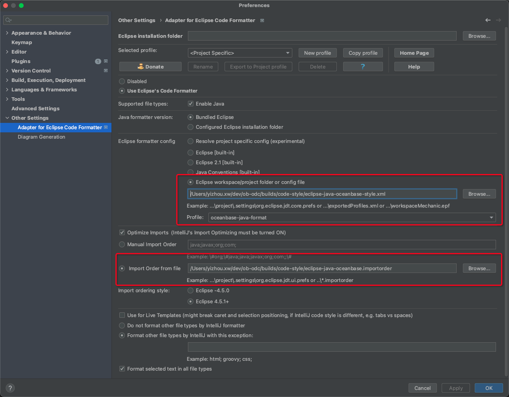
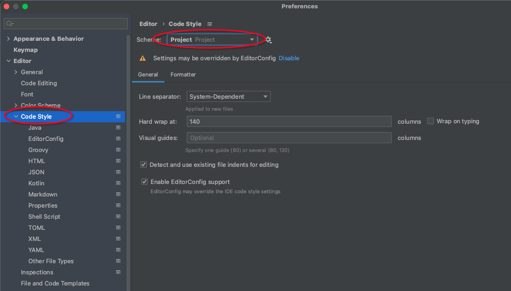
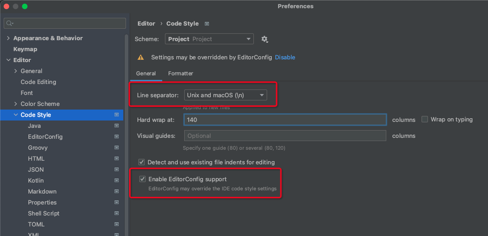
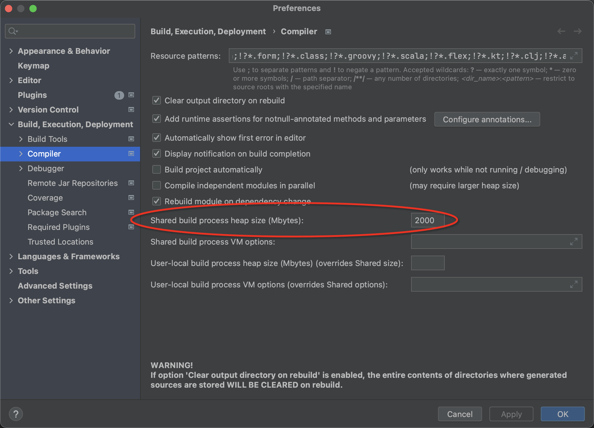
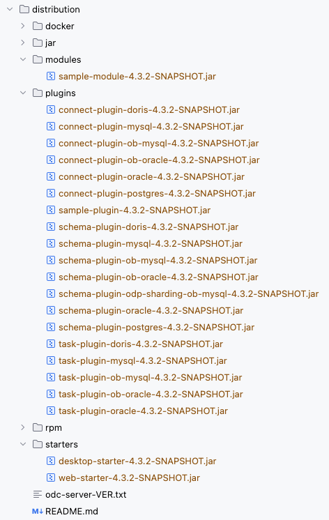
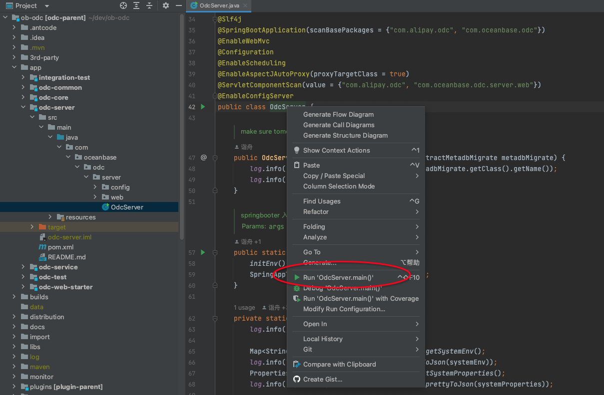
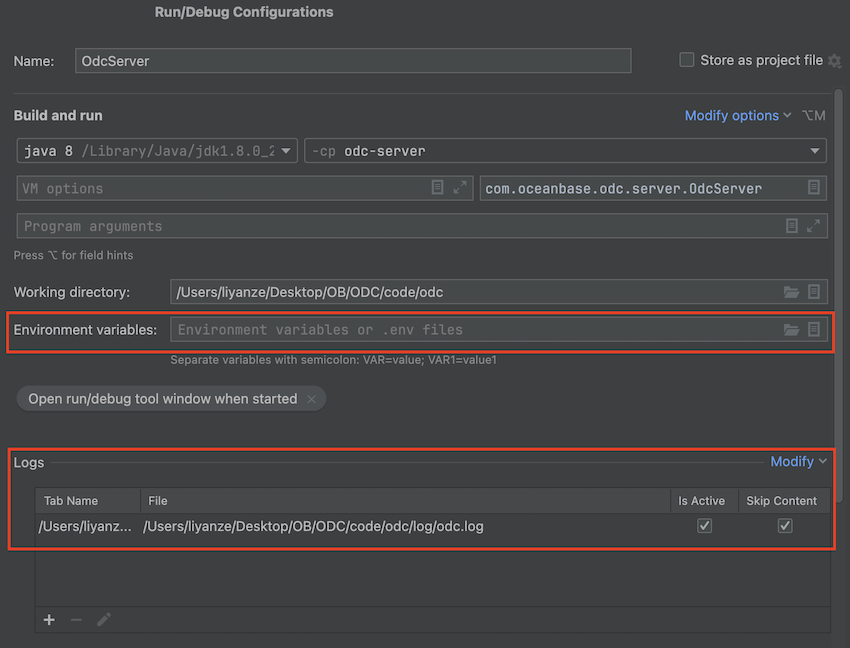
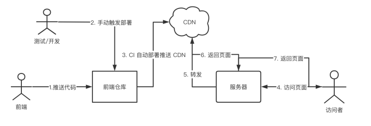
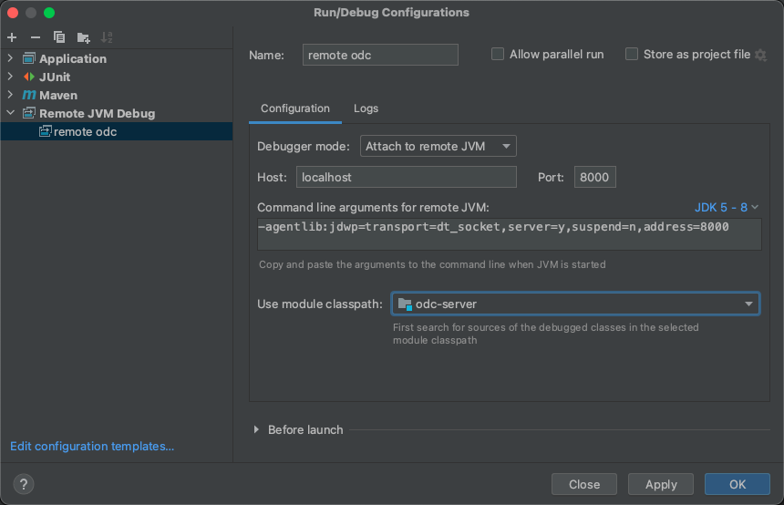
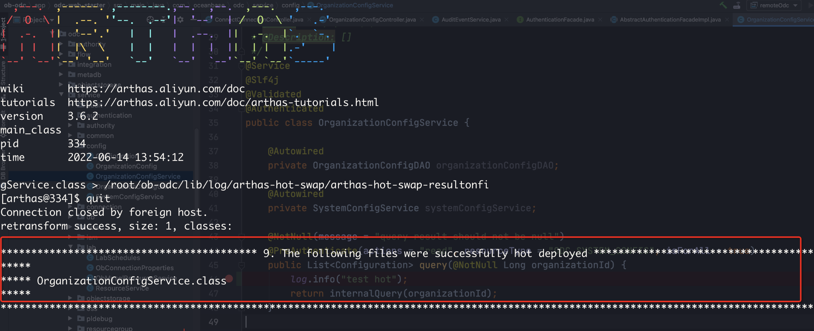

# ODC Backend Developer Guide

This article covers essential information for ODC backend development,
including environment setup, building, launching, and frontend-backend integration.
For frontend development, please refer to the [ODC Frontend Development Guide](https://github.com/oceanbase/odc-client/blob/main/README.md).

Preparing the development environment involves the following steps:

1. Configure Git and clone the code repository. <br>
   The first step is to clone the code repository because it contains some scripts to prepare the development environment, <br>
   which are located in the `script` directory.
2. Install the Java development environment, including JDK and Maven.
3. Install the Node.js development environment, including Node.js and pnpm (optional).
4. Configure the IDE, mainly the code formatting plugin configuration.
5. Configure the unit test running environment. <br>
   The database account and password required for unit testing are encrypted and stored in the configuration file, <br>
   so you need to configure the secret key on the development machine.

# 1. Clone the git repo

ODC backend repository locate at: [https://github.com/oceanbase/odc](https://github.com/oceanbase/odc)

```shell
# cd /your/workspace/directory
git clone git@github.com:oceanbase/odc.git
cd odc
```

# 2. Development Environment Setup

⚠️ Environment Preparation Notes

- Node.js/pnpm installation is not necessary for backend development environment, <br>
  as daily development testing is based on referencing front-end resource files through static resource server.
- Refer to [4.1 Front-end and back-end integration based on a static resource server](#4.1) for implementation details.
- If you prefer to develop in a command-line environment, you can ignore the IntelliJ IDEA configuration chapter.

## 2.1 Prepare Java develop environment

⚠️ Assume use CentOS7 or compatible Linux distributions

### 2.1.1 Install jdk 1.8.0

```shell
# install openjdk
yum install java-1.8.0-openjdk-devel

# check install path
alternatives --display java_sdk_1.8.0
```

### 2.1.2 Use Maven wrapper

To avoid environment differences caused by using different versions of Maven, <br>
the ODC project uses Maven Wrapper to specify the version number.

Please use the mvn wrapper command in the root directory of the repository:

- Use `mvnw` on Linux/Unix.
- Use `mvnw.cmd` on Windows.

### 2.1.3 Configure Maven

The Maven repository configuration required by ODC dependencies is already self-contained in `pom.xml` and does not require any configuration.

If you clone the code to your development environment and find that you cannot build it,
it may be because your Maven configuration is affecting the project's own Maven repository configuration.

You can check the following files:

- `~/.m2/settings.xml`
- `${M2_HOME}/conf/settings.xml`

## 2.2 Preparing the Node.js Development Environment (Optional)

Building the front-end project requires a Node.js/npm environment.

You can use the script provided in the code repository to initialize the Node.js development environment directly.

```shell
script/init_node_env.sh
```

## 2.3 IntelliJ IDEA Settings

IntelliJ IDEA Community edition is the recommended Java IDE for ODC.
You can download it from the [download page](https://www.jetbrains.com/idea/download/).

### 2.3.1 Recommended plugins

- [Adapter for Eclipse Code Formatter](https://plugins.jetbrains.com/plugin/6546-adapter-for-eclipse-code-formatter)
- [Lombok Plugin](https://plugins.jetbrains.com/plugin/6317-lombok)
- [Git Commit Template](https://plugins.jetbrains.com/plugin/9861-git-commit-template)
- [ArthasHotSwap](https://plugins.jetbrains.com/plugin/16437-arthashotswap)
- [Python Community Edition](https://plugins.jetbrains.com/plugin/7322-python-community-edition)

### 2.3.2 Code style settings

ODC use "Eclipse Code Formatter" to unify code style.

There are several code style lint solution, we select Eclipse Code Formatter because of

- Out of box for Eclipse user
- Available by Eclipse Code Formatter plugin for IDEA user
- Available by maven plugin, friendly for CI pipeline

The import optimization of the Eclipse Code Formatter plugin is based on the ability of IDEA,
so it also requires configuring related settings in IDEA.

#### 2.3.2.1 Eclipse Code Formatter Install & Configuration

**Installation**

Intellij IDEA --> Preferences --> Plugins --> Browse repositories --> Find 'Eclipse Code Formatter'，click install;

> Restart may required after plugin installed.

**Configuration**

Eclipse code format settings file locate at  `builds/code-style/` directory, includes

- code style settings: `eclipse-java-oceanbase-style.xml`
- import order settings: `eclipse-java-oceanbase.importorder`

The configuration interface for Intellij IDEA is located at <br>

- File --> Other Settings --> Default Settings --> Other Settings --> Eclipse Code Formatter

includes the following options:

- Select "Use the Eclipse code formatter"
- Choose Eclipse java Formatter config file: "builds/code-style/eclipse-java-oceanbase-style.xml"
    - Select Profile: "oceanbase-java-format"
- Optimize Imports
    - Choose "From file" and select "builds/code-style/eclipse-java-oceanbase.importorder"

**Configuration page example**



#### 2.3.2.2 Import `IDEA_code_style_oceanbase.xml`

Q: Why do we need to import the IDEA code style configuration even though we have already used Eclipse Code Formatter? <br>
A: The import optimize function of the Eclipse Code Formatter plugin is based on the ability of IDEA code style. <br>

The import here is mainly for setting the Imports.  <br>
The IDEA code formatting configuration for the ODC project is stored in the `.idea/codeStyle` directory in the Git repository. <br>
When importing the project into IDEA, the project-level code formatting configuration will be used by default, which should be ready to use.

If you find that your IDEA code formatting configuration does not meet your expectations, <br>
you can check if you have selected the Project scope configuration as shown in the following figure.



The complete original code formatting configuration file is located in the `builds/code-style/` directory,
and the functions of several files are listed as follows:

- `eclipse-java-oceanbase-style.xml`: the code formatting configuration used in this project,
  which is the Eclipse code formatter configuration file modified based on [eclipse-java-google-style.xml](https://github.com/google/styleguide/blob/gh-pages/eclipse-java-google-style.xml).
- `eclipse-java-oceanbase.importorder`: Eclipse code formatter importorder configuration file.
- `IDEA_code_style_oceanbase.xml`: IDEA code style configuration file, which is compatible with the above Eclipse code formatter configuration.

#### 2.3.2.3 Java import rules（reference）

This section is for reference only.  <br>
When configuring, import `builds/code-style/IDEA_code_style_oceanbase.xml` directly according to the method in the previous section.

- The import order is `static import`, `java.*`, `javax.*`, `org.*`, `com.*`, `alipay code import`, `other import`.
- The configuration order is as follows.

```
import static all other imports
<blank line>
import java.*              With Subpackages
<blank line>
import javax.*             With Subpackages
<blank line>
import org.*               With Subpackages
<blank line>
import com.*               With Subpackages
<blank line>
import com.alipay.*        With Subpackages
<blank line>
import all other imports
<blank line>
```

#### 2.3.2.4 Style for other file types (.editorconfig)

The configuration path for IDEA is Settings -> Code Style.

- The line separator is uniformly set to Unix-style `LF` (`\n`).
- Use the configuration of EditorConfig, and the configuration file `.editorconfig` is located in the project root directory.

The following is a schematic diagram of IDEA Code Style configuration.


### 2.3.3 IDEA Other Settings

#### 2.3.3.1 build process heap size

The default build process heap size in IntelliJ IDEA is set to 700M, which is too small for the ODC project and can result in compilation failures. To adjust this value to 2000MB, follow these steps:
Settings -> Build, Execution, Deployment -> Compiler -> Build process heap size .



## 2.4 Configure the unit test running environment.

Some of ODC's unit test cases rely on real database services, and the database account and password are encrypted and stored in the configuration file.

During local development, the environment configuration information required for unit testing can be maintained in the `local-unit-test.properties` file located in the root directory of the repository.

> To prevent the leakage of database information in the testing environment, the `local-unit-test.properties` file in the repository has been added to the `.gitignore` file.

Sample configuration

```properties
# Unit test OB cluster environment configuration.
# Sensitive value auto encrypt by com.oceanbase.odc.test.tool.EncryptableConfigurations.
# While change value, just input plain text and the value will be replaced to encrypted one while first time loaded
odc.ob.default.oracle.commandline=your_ob_oracle_test_tenant_obclient_cli_commandline
odc.ob.default.mysql.commandline=your_ob_mysql_test_tenant_obclient_cli_commandline
odc.mysql.default.commandline=your_mysql_test_server_mysql_cli_commandline
```

Unit tests may be executed locally and on the Github CI pipeline. <br>
The ODC unit test execution process reads the decryption key of the encrypted information through environment variables or a `.env` configuration file.

- The environment variables read by the Github CI pipeline are maintained through GitHub Actions Variable.
- The local development environment can maintain the value of the corresponding configuration item in the local environment variables or `.env` file.

The implementation principle can refer to `EncryptableConfiguration.java`. <br>
If you need to update the configuration file, you can directly modify the configuration file and execute any test case that depends on this configuration. <br>
When plaintext configuration is identified, EncryptableConfiguration will automatically encrypt and save it, and the plaintext will be automatically converted to ciphertext.

- Note that the key in the configuration file matches the regular expression `password|username|host|port|commandline` to generate the corresponding encrypted value
- The syntax of the encrypted value is ENC@{encrptedValue}.

# 3. Start odc-server

## 3.1 jar build and run

### 3.1.1 Dependent component installation

ODC relies on 2 self-developed components, which you can see in `libs` respectively. In the official release, if these two components are modified, we will upload them to the maven central warehouse for reference in advance, but during the development process, we will reference them through local installation. You need to manually install these two components locally before building, otherwise the build may not be successful. You can complete the installation of dependent components through the following shell script:

```shell
script/build_libs.sh
```

### 3.1.2 Build and start

Build or run scripts locate at `script` directory.

Build

```shell
#init node env for first build
script/init_node_env.sh

#update submodule
script/update_submodule.sh

#build frontend if needed
script/build_sqlconsole.sh

#build backend jar
script/build_jar.sh
```

Run

```shell
#set environment variables
export ODC_DATABASE_HOST="???"
export ODC_DATABASE_PORT==????
export ODC_DATABASE_NAME="???"
export ODC_DATABASE_USERNAME="???"
export ODC_DATABASE_PASSWORD="???"
export ODC_PROFILE_MODE="alipay"
export ODC_SERVER_PORT=8989

#nohup start
script/nohup-start-odc.sh
```

Stop

```shell
script/kill-odc.sh
```

## 3.2 rpm build and run

Use `script/build_rpm.sh` for rpm package build，includes submodule pulling/frontend build/backend build/rpm build steps.

Build then install

```shell
#init node env for first build
script/init_node_env.sh

#build rpm package
script/build_rpm.sh

#install rpm package
#default rpm package install directory is /opt/odc
cd distribution/docker/resources
sudo rpm -i odc-server-*.rpm
```

Run

```shell
#set environment variables
export ODC_DATABASE_HOST="???"
export ODC_DATABASE_PORT==????
export ODC_DATABASE_NAME="???"
export ODC_DATABASE_USERNAME="???"
export ODC_DATABASE_PASSWORD="???"
export ODC_PROFILE_MODE="alipay"
export ODC_SERVER_PORT=8989

#start odc-server
/opt/odc/bin/start-odc.sh
```

## 3.3 Start odc-server in IDEA

The OdcServer class is the entry point for the odc-server program and can be run directly.
The first run will fail because there are no startup parameters configured, and retrieving the metadb configuration will result in an error.

### 3.3.1 Frontend Resources

The IDE startup also depends on frontend resources. There are two ways to handle this: building the frontend resources locally or referencing the frontend static resources.

**Option 1: Building Frontend Resources Locally**
You can use the following script to build the frontend resources. This script will complete the build process and copy the resource files to the resources directory of the odc-server module.

```shell
#init node env for first build
script/init_node_env.sh

#sync submodule odc-client to client
script/update_submodule.sh

#build odc-client
script/build_sqlconsole.sh
```

**Option 2: Referencing Frontend Static Resources**

When starting the ODC Server, you can add the following configuration to the startup options, which will automatically fetch the frontend resources. In a development mode where frontend and backend are separate, this approach allows backend developers to not worry about the frontend build process.
Please note that in the example below, http://static-resource-server/dev-4.2.2/index.html is a placeholder URL and should be replaced with the actual address.

```shell
--ODC_INDEX_PAGE_URI=http://static-resource-server/dev-4.2.2/index.html
```

By adding this configuration, the ODC Server will fetch the frontend static resources from the specified URL during startup. This allows the frontend and backend to work together seamlessly in a decoupled development environment.

### 3.3.2 First-time Build

Before starting the odc-server, you need to complete the first-time build, including building the libs and plugins.

- If there are unpublished updates in the libs directory, you need to follow the instructions in section 3.1.1 to install the dependency components.
- Next, you need to build the plugins. The plugin build is integrated into the ODC build process, and you can use the following shell command to complete the backend build of ODC.

```shell
script/build_jar.sh
```

After the build is complete, you can see the built plugins in the distribution/plugins and distribution/starters directories.



### 3.3.3 Start OdcServer

**Running OdcServer**

Find the OdcServer class and right-click to start it.



**Setting up Launch Parameters**

The launch parameters should be set as follows:

```shell
--ODC_DATABASE_HOST=your_metadb_host --ODC_DATABASE_PORT=your_metadb_port --ODC_DATABASE_NAME=your_metadb_database --ODC_DATABASE_USERNAME=your_metadb_user --ODC_DATABASE_PASSWORD=your_metadb_password --server.port=8989
```

Notice here we use Spring environment variables arguments `--`, not VM options（ `-D`）, example

Note that these are environment variables specified using the -- syntax, not VM options using the -D syntax.
To conveniently view the log after running, you can configure the contents of the log/odc.log file to be displayed in the console.

The setup for starting OdcServer is shown below.



# 4. Frontend-backend integration

## 4.1 Front-end and back-end integration based on a static resource server <a id='4.1'></a>

The ODC code repository includes both front-end and back-end repositories,
which are currently integrated and packaged by including the front-end repository in the back-end repository as a git submodule.

Because pulling submodules and building front-end resources can consume a lot of resources (taking about 10 minutes),
during the development phase, the back-end pipeline will no longer pull and build front-end submodules.
Instead, it will download the latest iteration of the `index.html` file corresponding to the front-end, which references resources on the static resource server.

### 4.1.1 Concept



Static resource files URL template `http://static-resource-server/oceanbase/odc/{branchName}/xxx` .
here `{branchName}` mean git branch name of frontend repository.

e.g. branch `dev-4.2.2`, The `index.html` refer URL is `http://static-resource-server/dev-4.2.2/index.html` .

### 4.1.3 Automate refresh frontend resource

How can the back-end obtain the latest `index.html` file and reference the latest resources if there are updates to front-end CDN resources?

When starting the odc-server, you can configure the environment variable `ODC_INDEX_PAGE_URI` and set its value to the complete address of the corresponding `index.html` file.

An example configuration is shown below.

```shell
export ODC_INDEX_PAGE_URI=http://static-resource-server/dev-4.2.2/index.html
```

## 4.3 TraceId based log analysis

RequestId and TraceId

- When the ODC frontend initiates a request to the backend, the request header includes `X-Request-ID`.
- Upon receiving the request, the backend automatically generates a TraceId.
- When outputting logs, the backend includes both RequestId and TraceId.

In addition to RequestId and TraceId, the ODC API response also includes some fields for convenient log viewing.

- server: the name of the ODC node, which can be used to distinguish odc-server nodes in a multi-node deployment scenario.
- timestamp: the timestamp of request processing.

Example response:

```json
{
    "data": {},
    "durationMillis": 6,
    "requestId": "9OHE7OG3LCPXYOTM4IQTQL",
    "server": "192.168.1.1",
    "timestamp": 1621843116.031,
    "traceId": "273b3de3588b4b9c"
}
```

5. Remote Debugging Techniques

## 5.1 Remote Debugging with IDEA

### 5.1.1 Configuration in IDEA

Add Remote JVM Debug, enter Name, Host, and Port.



Copy the automatically generated JVM command line parameters to run ODCServer in remote debugging mode on the remote machine.

The parameter format is like `-agentlib:jdwp=transport=dt_socket,server=y,suspend=n,address=8000`, where each parameter means:

- transport: the connection method for listening to Socket ports. The commonly used `dt_socket` indicates connection through Socket.
- server: `=y` indicates the current process is the debug server, `=n` indicates the current process is the debug client.
- suspend: `=n` indicates not to suspend when starting.
- address: indicates the local listening address and port.

### 5.1.2 Starting ODCServer on the Server

Set the environment variable `ODC_REMOTE_DEBUG_PORT` to the PORT value set in IDEA when starting the ODC serve, <br>
using the `script/start-odc.sh` script to enable remote debugging.

The startup script is as follows:

```shell
export ODC_REMOTE_DEBUG_PORT=8000
script/start-odc.sh
```

### 5.1.3 Start Debugging in IDEA

All preparations are now complete, and you can start debugging with breakpoints in IDEA.

## 5.2 Hot Deployment with ArthasHotSwap Plugin

We can perform remote debugging as described in 5.1, but the experience is not very good.

For example, if we encounter a problem during debugging or want to add some logs, we need to go through the following steps:

- modify code -> compile -> package JAR -> upload JAR to the server -> run JAR on the remote server -> debug in IDEA.

The steps are cumbersome, and easily take up 10-20 minutes. <br>
Using the ArthasHotSwap plugin, we can complete hot deployment within 1 minute, <br>
without compiling the entire project, uploading JAR, or restarting ODC, we just need to copy & paste. The specific steps are as follows:

### 5.2.1 Install the ArthasHotSwap Plugin

Before using ArthasHotSwap for hot deployment for the first time, you need to install the ArthasHotSwap plugin.

### 5.2.2 Modify the Code for Hot Deployment

**Step 1: Compile the modified code**

If only a few classes are modified, you can right-click a class in the left navigation bar, <br>
then click **Recompile** to save a lot of compilation time.

The recompiled `.class` file will overwrite the previous `.class` file.

**Step 2: Generate a Hot Deployment Command for the class**

Select the java source file or `.class` file that needs to be hot-deployed, right-click the class name, <br>
choose "Swap this class" in "Arthas Hot Swap", <br>
then the plugin will copy the hot deployment command to the clipboard after executing successfully.

**Step 3: Execute the Hot Deployment Command on the Remote Machine**

Log in to the server, paste the hot deployment command, and execute it. <br>
After the hot deployment is complete, the machine is running the latest class.<br>
If the machine fails to execute the hot deployment command for the first time, try again.

The diagram below shows the success of hot deployment.


