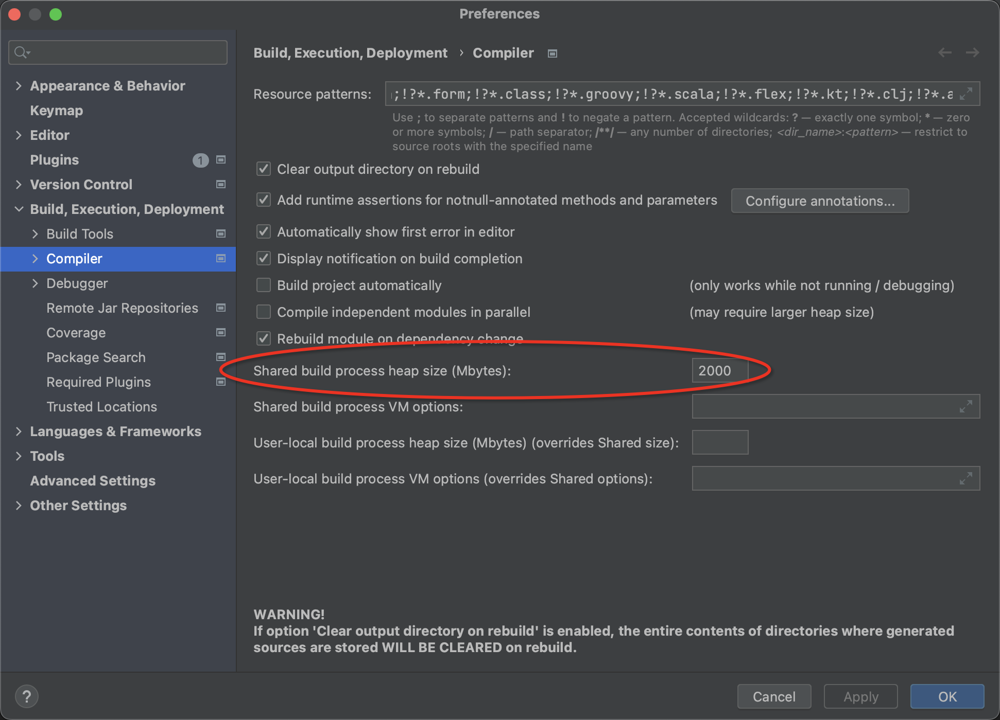
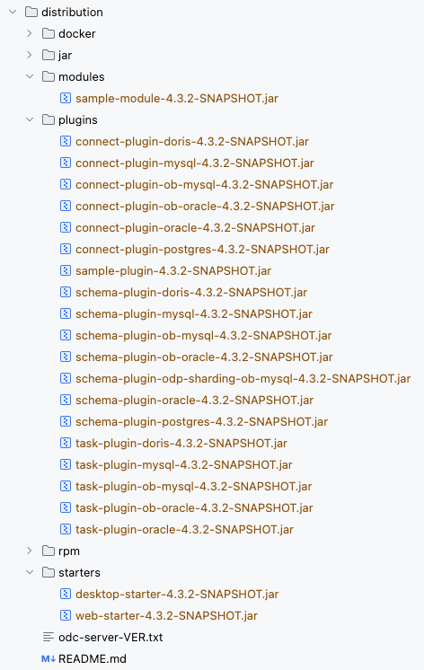
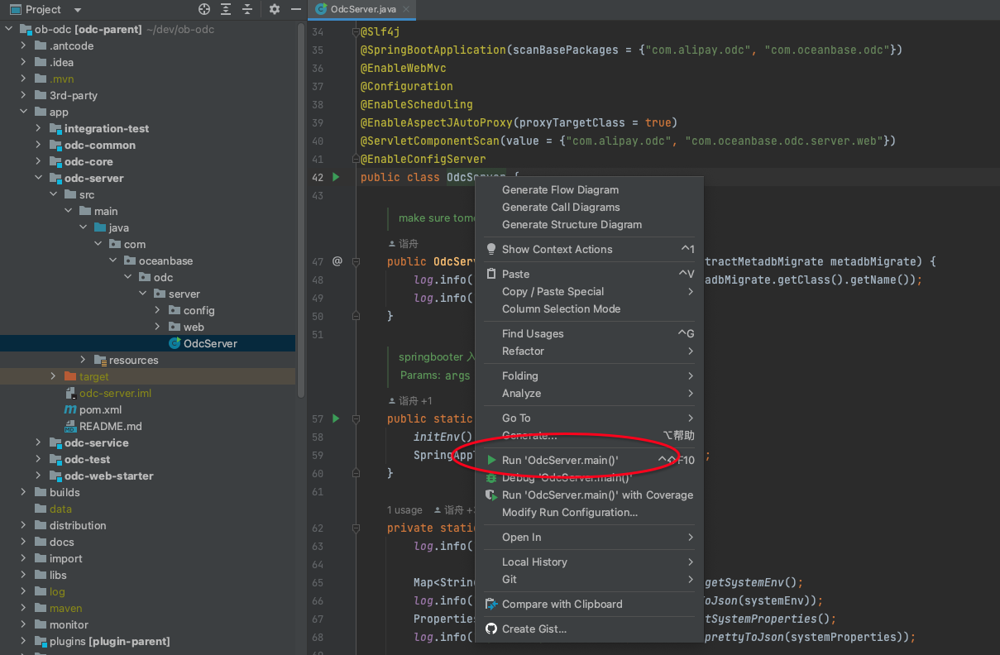
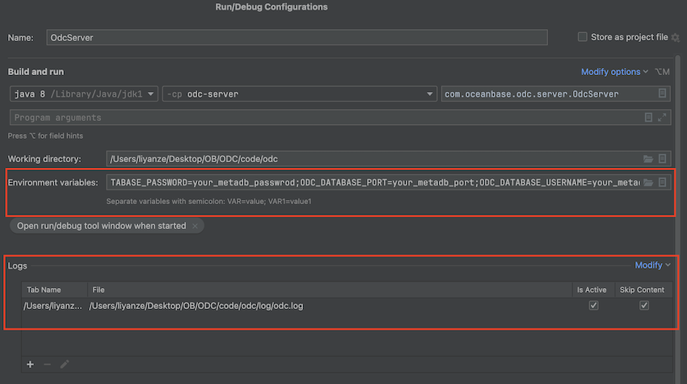
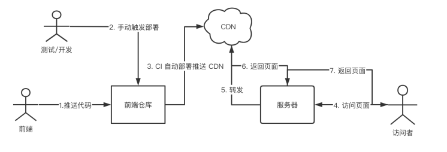
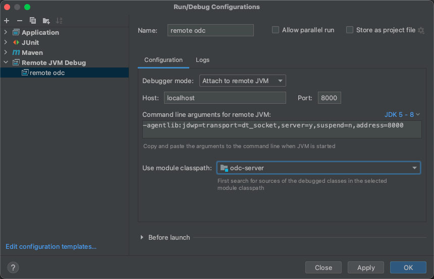

# ODC 后端开发指南

本文内容包括 ODC 后端开发需要了解的必要信息，包括环境搭建、构建、启动、前后端联调等。
前端开发参见 [ODC 前端开发指南](https://github.com/oceanbase/odc-client/blob/main/docs/README_CN.md) 。

准备开发环境的过程，包括以下几个步骤

1. 配置 git 并拉取代码仓库，第一步是拉取代码仓库是因为仓库里包含一些准备开发环境的脚本，位于 `script` 目录 。
2. 安装 Java 开发环境，包括 JDK 和 Maven 。
3. 安装 Node.js 开发环境，包括 Node.js 和 pnpm （非必须）。
4. 配置 IDE，主要是代码格式化插件配置 。
5. 配置 单元测试运行环境，单元测试依赖的数据库帐密是加密存储在配置文件中的，需要配置秘钥到开发机 。

# 1. 拉取代码仓库

后端代码仓库：[https://github.com/oceanbase/odc](https://github.com/oceanbase/odc)

```shell
# cd /your/workspace/directory
git clone git@github.com:oceanbase/odc.git
cd odc
```

# 2. 开发环境准备

⚠️ 环境准备说明

- 后端开发环境也可以不安装 node.js/pnpm，因为日常开发测试是基于 CDN 引用前端资源文件的，实现原理可以参考 [4.1 基于静态资源服务器的前后端联调](#4.1) 。
- 如果习惯在命令行环境下开发，可忽略 IntelliJ IDEA 配置章节。

## 2.1 准备 java 开发环境

> 假设使用 CentOS7 或其他兼容的 Linux 发行版

### 2.1.1 安装 jdk 1.8.0

```shell
# install openjdk
yum install java-1.8.0-openjdk-devel

# check install path
alternatives --display java_sdk_1.8.0
```

### 2.1.2 使用 Maven wrapper

为避免使用不同 Maven 版本带来的环境差异问题，ODC 项目使用 Maven Wrapper 指定版本号。

请直接使用仓库根目录的 mvn wrapper 命令:

- Linux/Unix 下使用 `mvnw`
- Windows 下使用 `mvnw.cmd`

### 2.1.3 配置 maven

ODC 依赖的 maven 仓库配置已经自包含在 `pom.xml`，不需要做任何配置。

如果代码 clone 到开发环境，发现无法构建成功，有可能是你的 maven 配置影响了项目自身的 maven 仓库配置，可检查以下文件：

- `~/.m2/settings.xml`- `${M2_HOME}/conf/settings.xml`

## 2.2 准备 node.js 开发环境（非必须）

可以直接使用代码仓库里的脚本初始化 node.js 开发环境。

```shell
script/init_node_env.sh
```

## 2.3 IntelliJ IDEA 配置

IntelliJ IDEA Community 版本是 ODC 推荐使用的 Java IDE [下载页面](https://www.jetbrains.com/idea/download/)）。

### 2.3.1 推荐的插件

- [Adapter for Eclipse Code Formatter](https://plugins.jetbrains.com/plugin/6546-adapter-for-eclipse-code-formatter)
- [Lombok Plugin](https://plugins.jetbrains.com/plugin/6317-lombok)
- [Git Commit Template](https://plugins.jetbrains.com/plugin/9861-git-commit-template)
- [ArthasHotSwap](https://plugins.jetbrains.com/plugin/16437-arthashotswap)
- [Python Community Edition](https://plugins.jetbrains.com/plugin/7322-python-community-edition)

### 2.3.2 代码格式化配置

为统一代码格式，采用 Eclipse Code Formatter 格式化 Java 代码

- Eclipse 可直接使用
- IDEA 通过 Eclipse Code Formatter 插件使用
- 编译时通过 maven 插件格式化代码

> Eclipse Code Formatter 插件的 import 优化是基于 IDEA能力的，因此还需要配置 IDEA 相关配置。

#### 2.3.2.1 Eclipse Code Formatter 安装配置

**安装**

Intellij IDEA-->Preferences-->Plugins-->Browse repositories-->查找 Eclipse Code Formatter，点击 install;
安装完成后重启 Intellij IDEA。

**导入配置**

Eclipse code format 配置文件 位于 `builds/code-style/` 目录， 包括

- 代码格式配置 `eclipse-java-oceanbase-style.xml`
- import order 配置 `eclipse-java-oceanbase.importorder`

Intellij IDEA 配置界面位于 File-->Other Settings --> Default Settings --> Other Settings--> Eclipse Code Formatter，配置项包括

- 选择 Use the Eclipse code formatter
- Eclipse java Formatter config file 选择 `builds/code-style/eclipse-java-oceanbase-style.xml`
    - Profile 选择 `oceanbase-java-format`
- Optimize Imports
    - From file，选择 `builds/code-style/eclipse-java-oceanbase.importorder`

**配置示意图**


#### 2.3.2.2 导入 `IDEA_code_style_oceanbase.xml`

Q: 为什么已经使用了 Eclipse Code Formatter 还需要导入 IDEA code style 配置？ <br>
A: Eclipse Code Formatter 插件的 import optimize 功能是基于 IDEA code style 能力的，这里导入主要是为了配置 Imports 设定。

ODC 项目的 IDEA 代码格式化配置已经放在 git 仓库，对应目录 `.idea/codeStyle` 。
导入项目到 IDEA 时，默认会使用项目级别的代码格式化配置，应该是开箱即用的。

如果你发现自己的 IDEA 代码格式化配置不符合预期，可检查是否选择了 Project 范围的配置，如下图所示。


完整的代码格式化原始配置文件位于 `builds/code-style/` 目录，几个文件的作用列举如下。

- `eclipse-java-oceanbase-style.xml` 本项目使用的代码格式化配置，eclipse code formatter 配置文件
    - 基于 [eclipse-java-google-style.xml](https://github.com/google/styleguide/blob/gh-pages/eclipse-java-google-style.xml) 配置修改得到
- `eclipse-java-oceanbase.importorder` eclipse code formatter importorder 配置文件
- `IDEA_code_style_oceanbase.xml` IDEA code style 配置, 和上述 eclipse code formatter 配置兼容

#### 2.3.2.3 Java import 规则配置（参考）

> 本部分仅供参考，实际配置时按照上一节的方式直接导入 `builds/code-style/IDEA_code_style_oceanbase.xml` 即可。

- import 顺序为 `static import` , `java.*` ,`javax.*`, `org.*`, `com.*`, `alipay代码 import` , `其它 import`
- 配置顺序如下

```
import static all other imports
<blank line>
import java.*              With Subpackages
<blank line>
import javax.*             With Subpackages
<blank line>
import org.*               With Subpackages
<blank line>
import com.*               With Subpackages
<blank line>
import com.alipay.*        With Subpackages
<blank line>
import all other imports
<blank line>
```

#### 2.3.2.4 其它文件类型的格式配置 .editorconfig（资料）

IDEA 配置路径为 Settings -> Code Style

- 换行符统一为 Unix风格的 `LF` ( `\n` )
- 使用 EditorConfig 的配置，配置文件`.editorconfig` 位于 project 根目录

IDEA Code Style 配置示意图


### 2.3.3 IDEA 其他重要配置

#### 2.3.3.1 build process heap size

IDEA 默认的 build process heap size 为 700M，对于 ODC 项目来说，这个值太小了，会导致编译失败。

这里调整为 2000MB，配置路径为 Settings -> Build, Execution, Deployment -> Compiler -> Build process heap size。



## 2.4 配置单元测试运行环境

ODC 的部分单元测试用例依赖真实的数据库服务，数据库帐密是加密存储在配置文件里的。

本地开发时，单元测试依赖的环境配置信息可以维护在仓库根目录的 `local-unit-test.properties` 文件。
> 为了避免测试环境的数据库信息泄露，仓库里的 `local-unit-test.properties` 文件已经加入 `.gitignore` 。

配置样例如下。

```properties
# Unit test OB cluster environment configuration.
# Sensitive value auto encrypt by com.oceanbase.odc.test.tool.EncryptableConfigurations.
# While change value, just input plain text and the value will be replaced to encrypted one while first time loaded
odc.ob.default.oracle.commandline=your_ob_oracle_test_tenant_obclient_cli_commandline
odc.ob.default.mysql.commandline=your_ob_mysql_test_tenant_obclient_cli_commandline
odc.mysql.default.commandline=your_mysql_test_server_mysql_cli_commandline
```

单元测试可能在本地和 Github CI 流水线执行，ODC 单元测试执行过程通过环境变量或者 `.env` 配置文件读取加密信息的解密密钥。

- Github CI 流水线读取的环境变量通过 GitHub Actions Variable 维护
- 本地开发环境可以通过把对应的配置项的值维护在本地环境变量或者 `.env` 文件实现

实现原理可参考 `EncryptableConfiguration.java` 。<br>
如果需要更新配置文件，可以直接修改配置文件，并执行任意一个依赖此配置的测试用例。<br>
识别到明文配置时，EncryptableConfiguration 会做自动加密、保存，明文会自动转换为密文。

> 注意配置文件中 key 匹配正则表达式 `password|username|host|port|commandline` 才会生成对应的加密值，<br>
> 加密值的语法为 `ENC@{encrptedValue}` 。

# 3. 启动 odc-server

## 3.1 jar 构建和启动

### 3.1.1 依赖组件安装

ODC 依赖 2 个自研组件，您可以分别在`libs`目录下看到它们。在正式的发布中，如果对这 2 个组件进行了修改，我们会提前将其上传至 maven 中央仓库以供引用，但是在开发过程中我们是通过本地安装的方式进行引用的。您在构建之前需要手动将这 2 个组件安装到本地，否则可能会导致构建不成功。您可以通过以下 shell 脚本完成依赖组件的安装：

```shell
script/build_libs.sh
```

### 3.1.2 构建和启动

构建和启动可以使用 `script` 目录的脚本实现，过程如下

构建

```shell
#init node env for first build
script/init_node_env.sh

#update submodule
script/update_submodule.sh

#build frontend if needed
script/build_sqlconsole.sh

#build backend jar
script/build_jar.sh
```

启动

```shell
#set environment variables
export ODC_DATABASE_HOST="???"
export ODC_DATABASE_PORT==????
export ODC_DATABASE_NAME="???"
export ODC_DATABASE_USERNAME="???"
export ODC_DATABASE_PASSWORD="???"
export ODC_PROFILE_MODE="alipay"
export ODC_SERVER_PORT=8989

#nohup start
script/nohup-start-odc.sh
```

停止

```shell
script/kill-odc.sh
```

## 3.2 rpm 构建和启动

rpm 构建可直接使用脚本 `script/build_rpm.sh` ，已包含前端子模块拉取、前端构建、后端rpm构建等过程。

构建和安装

```shell
#init node env for first build
script/init_node_env.sh

#build rpm package
script/build_rpm.sh

#install rpm package
#default rpm package install directory is /opt/odc
cd distribution/docker/resources
sudo rpm -i odc-server-*.rpm
```

启动

```shell
#set environment variables
export ODC_DATABASE_HOST="???"
export ODC_DATABASE_PORT==????
export ODC_DATABASE_NAME="???"
export ODC_DATABASE_USERNAME="???"
export ODC_DATABASE_PASSWORD="???"
export ODC_PROFILE_MODE="alipay"
export ODC_SERVER_PORT=8989

#start odc-server
/opt/odc/bin/start-odc.sh
```

## 3.3 IDEA 启动 odc-server

OdcServer 类是 odc-server 程序入口，可直接运行。 首次运行会失败，因为还没有配置启动参数，获取 metadb 配置会出错。

### 3.3.1 前端资源

IDE 启动也依赖前端资源。可以采取本地构建的方式，也可以采取引用前端静态资源的方式。

**方式一. 本地构建前端资源**

使用以下脚本构建前端资源，会完成构建并拷贝资源文件到到 odc-server 模块 resources 目录。

```shell
#init node env for first build
script/init_node_env.sh

#sync submodule odc-client to client
script/update_submodule.sh

#build odc-client
script/build_sqlconsole.sh
```

**方式二. 引用前端静态资源**

启动 ODC Server 时在启动项中添加如下配置，会自动拉取前端资源。前后端分离的研发协同模式下，采用这个方式后端开发可以不关注前端构建过程。

注意以下样例里的 `http://static-resource-server/dev-4.2.2/index.html` 是一个示意地址，实际使用时需要替换为对应的地址。

```shell
--ODC_INDEX_PAGE_URI=http://static-resource-server/dev-4.2.2/index.html
```

### 3.3.2 首次构建

在启动 odc-server 之前，还需要完成首次构建，包括 libs 构建和 plugins 构建。

- 如果 libs 目录存在未发布的更新，需要按照 3.1.1 章节的指引完成依赖组件的安装。
- 接下来需要完成插件的构建，插件的构建是集成在 ODC 的构建过程中的，您可以通过以下 shell 命令完成 ODC 后端构建。

```shell
script/build_jar.sh
```

构建完成后，您可以在`distribution/plugins`以及`distribution/starters` 目录中看到这些构建完成的插件。



### 3.3.3 启动 OdcServer

**运行 OdcServer**

找到 OdcServer 类，右键启动。



**设置启动参数**

启动参数样例如下

```shell
--ODC_DATABASE_HOST=your_metadb_host --ODC_DATABASE_PORT=your_metadb_port --ODC_DATABASE_NAME=your_metadb_database --ODC_DATABASE_USERNAME=your_metadb_user --ODC_DATABASE_PASSWORD=your_metadb_password --server.port=8989
```

注意配置的是 环境变量（environment variables，`--`语法），而不是 VM options（ `-D`语法）。
为方便运行之后查看日志，可以配置 log/odc.log 文件内容在 console 中展示。

OdcServer 启动设置示意如下



# 4. 前后端集成和联调

## 4.1 基于静态资源服务器的前后端联调 <a id='4.1'></a>

ODC 代码仓库包括前端仓库和后端仓库，目前通过 后端仓库以 git submodule 包含前端仓库的方式集成打包。
由于拉取 submodule 和构建前端资源过程会占用较多资源（耗时大约 10分钟），开发阶段后端流水线不再拉取和构建前端子模块，而是下载前端对应迭代最新的
index.html 文件。 这个 `index.html`文件引用静态资源服务器资源。

### 4.1.1 实现原理



静态资源 URL 地址规则 `http://static-resource-server/{branchName}/xxx` .
其中 `{branchName}` 表示前端分支名称。

如 dev-4.2.2 分支，后端引用的 `index.html` URL 为 `http://static-resource-server/dev-4.2.2/index.html` 。

### 4.1.3 设置自动更新静态资源

如果前端资源有更新，后端如何获取到最新的 `index.html`从而引用到最新的资源呢？
在启动 odc-server 时配置环境变量 `ODC_INDEX_PAGE_URI`，值设置为对应 `index.html`文件的完整地址即可。

设置样例如下。

```shell
export ODC_INDEX_PAGE_URI=http://static-resource-server/dev-4.2.2/index.html
```

## 4.3 基于 traceId 的日志排查

RequestId 和 TraceId

- ODC 前端向后端发起请求时，request header 会包含 `X-Request-ID`，类似：`**X-Request-ID: **9OHE7OG3LCPXYOTM4IQTQL`
- 后端在接收请求时，会自动成成一个 TraceId
- 后端日志输出时，会带上 RequestId 和 TraceId

除了 requestId 和 traceId，ODC API response 中还包含一些辅助日志查看的字段

- server： ODC 节点名称，在多节点部署场景下可以用于区分 odc-server 节点
- timestamp：请求处理时间戳

response 样例如下

```json
{
    "data": {},
    "durationMillis": 6,
    "requestId": "9OHE7OG3LCPXYOTM4IQTQL",
    "server": "192.168.1.1",
    "timestamp": 1621843116.031,
    "traceId": "273b3de3588b4b9c"
}
```

# 5. 远程调试技巧

## 5.1 在 IDEA 进行远程调试

### 5.1.1 在 IDEA 中配置

增加 Remote JVM Debug, 填写 Name, Host, Port。



拷贝自动生成的 JVM 命令行参数到以在远程机器以远程调试模式运行 ODCServer。

参数样例如 `-agentlib:jdwp=transport=dt_socket,server=y,suspend=n,address=8000`，其中各参数的含义如下：

- transport：监听 Socket 端口连接方式,常用的 dt_socket 表示使用 socket 连接。
- server：`=y` 表示当前是调试服务端，=n 表示当前是调试客户端。
- suspend：`=n` 表示启动时不中断。
- address：表示本地监听的地址和端口。

### 5.1.2 在服务器上启动 ODCServer

使用 script/start-odc.sh 脚本启动时设置环境变量 `ODC_REMOTE_DEBUG_PORT` 为 IDEA 中设置的 PORT 值即可开启远程调试。

启动脚本样例如下

```shell
export ODC_REMOTE_DEBUG_PORT=8000
script/start-odc.sh
```

### 5.1.3 在 IDEA 开始调试

到此为止，所有准备工作已经就绪了，可以在 IDEA 中愉快地打断点捉虫了~

## 5.2 使用 ArthasHotSwap 插件进行热部署

通过 5.1 的步骤我们已经可以进行远程调试了，但是体验还不是很好。

比如，我们在调试过程中发现问题了，或者想加一些日志，那我们需要经历以下步骤：
改代码 -> 编译 -> 打 JAR 包 -> 把 JAR 包上传到服务器 -> 在远程服务器上重新运行 JAR 包 -> 在本地 IDEA 调试，步骤比较繁琐，随随便便一二十分钟就过去了。

使用 ArthasHotSwap 插件进行热部署 1 分钟就可以搞定，无需整个项目编译，无需上传 JAR 包，无需重新启动 ODC，只需要 copy & paste 一下就好了。具体操作步骤如下：

### 5.2.1 安装 ArthasHotSwap 插件

首次使用 ArthasHotSwap 进行热部署之前，需要先安装 ArthasHotSwap 插件。

### 5.2.2 修改代码进行热部署

**步骤1 修改代码后编译**

如果只涉及少数类的修改，可以在左侧导航栏右击某个类，点击**重新编译**，可大大节省编译时间。重新编译后的 .class 文件会覆盖掉之前的
.class 文件；

**步骤2 选择 class 生成热部署命令**

选择需要热部署的 java 源文件或者 .class 文件，在类名上单击右键，选择 "Arthas Hot Swap" 的 "Swap this class"，插件后台执行成功后会把热部署需要的命令复制到粘贴板

**步骤3 在远程机器执行热部署命令**

登录服务器，粘贴热部署命令并执行，热部署完成，该机器运行着最新的class。
机器第一次执行热部署命令，可能失败，再执行一次试下就好。

热部署成功后的示意图如下图所示。

